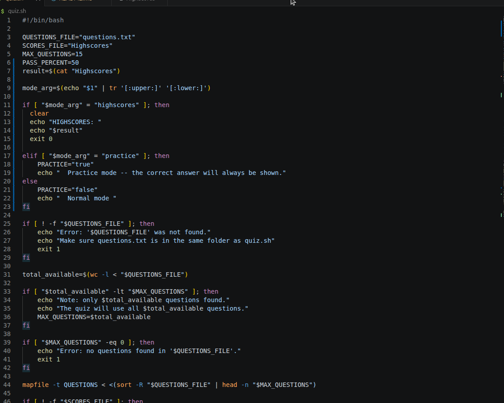
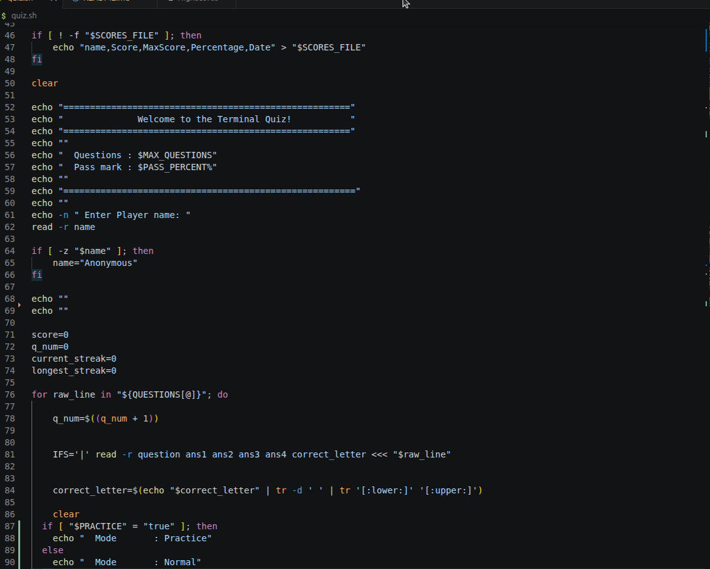
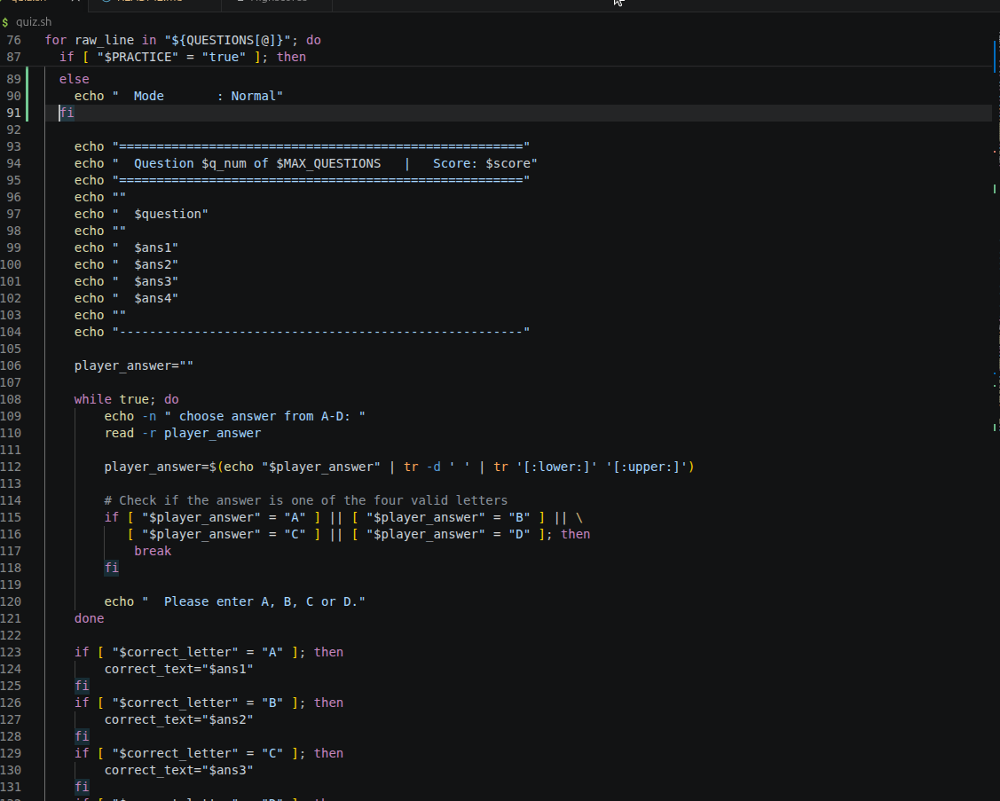
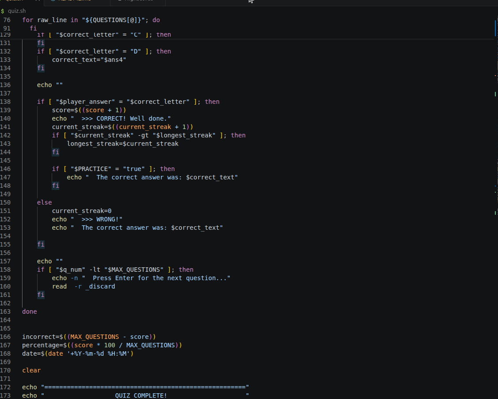
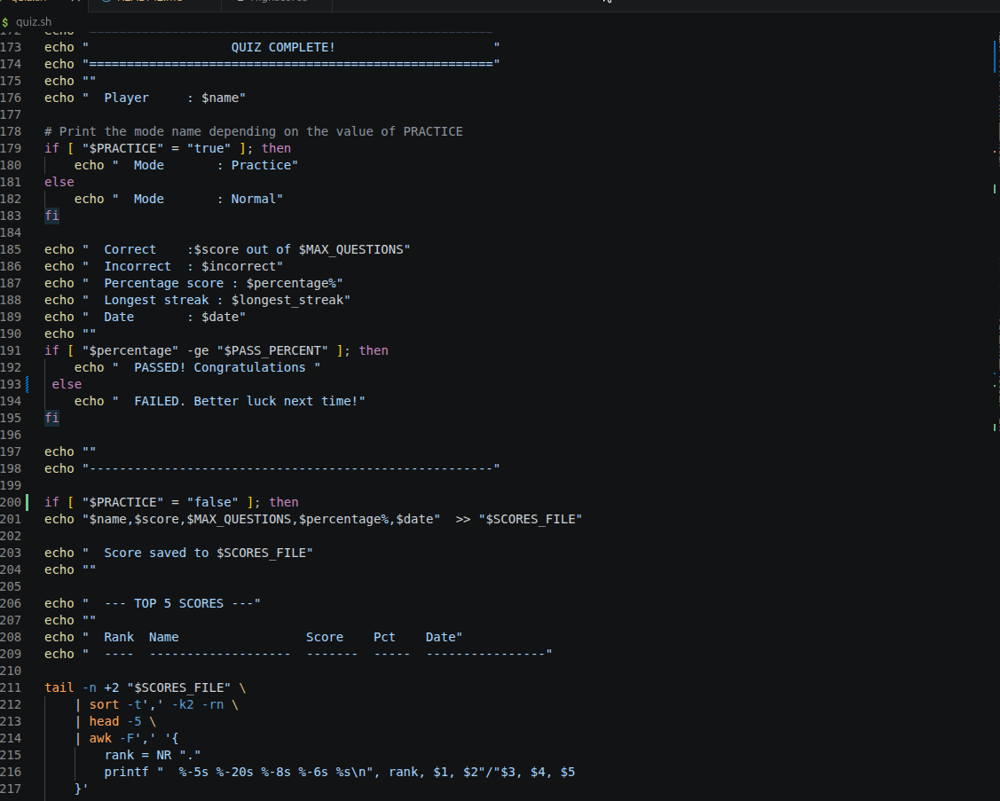
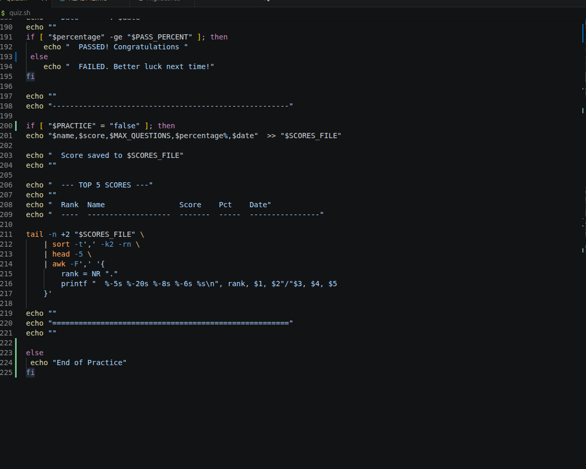

# 🏷 Project Name

> Short one-line description of what this project does.
The bash script will load questions from a file, present them to the user in random order, accept player answers, track scoring and streaks, and save high scores.


---

## 📌 Problem Statement

Describe the real-world problem this project solves.

shuffling of the questions found in a file , display, validation of user input and record of scores are handle by the computer which is fast , efficient and accurate

---

## 🎯 Project Goals

- The game will load questions from a file
- Present them to the user in random order
- Accept player answers
- Track scoring and streaks
- Save high scores.

md

---

## 🛠 Tech Stack

**Backend:**
- Bash

**Other Tools:**  
- Git & GitHub  

---

## 🖥 Features

- file parsing
- randomization
- loops
- user input
- basic state management
- error handling
- multi-part data structures
- simple data persistence

---

## 📷 Screenshots

(Add screenshots here)








---

## ⚙ Installation & Setup

Clone the repository:

```bash
git clone https://github.com/Stanice-netizen/terminal_quiz
cd quiz.sh
Install dependencies:
npm install
Run the project:
npm start

🧠 Challenges Faced

Validating user input
Question shuffling
Keeping track of scores and storing in a file
Managing output format


📚 What I Learned
s
Validating user input
Question shuffling
Keeping track of scores and storing in a file
Managing output format


 Future Improvements
Produce color coded output
writing shorter codes

👨🏽‍💻 Author
Your Losha Stanice
Junior Fullstack Developer
📩 Email: kieramaxswell@gmail.com
🌍 Based in Cameroon | Open to remote opportunities

